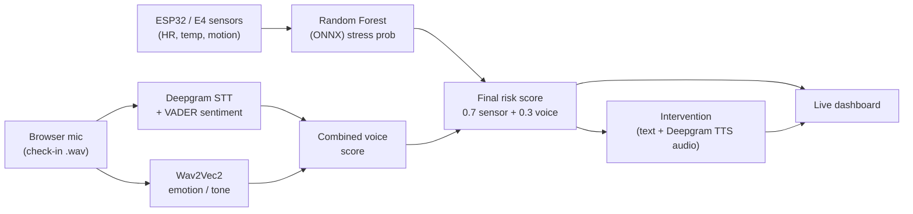

# Shift-Guard: Worker Fatigue & Stress Detection

AI-powered, real-time stress detection for healthcare and other high-stakes shift workers. Shift-Guard fuses **physiological sensor data** with **voice analysis** (what you say *and* how you say it) into a single risk score, and delivers a calm spoken intervention when stress runs high.

---

## How It Works



Three complementary signals combine because they fail on different cases:

1. **Sensor model** — Random Forest on WESAD physiological data (heart rate, skin temperature, motion), exported to ONNX. Validated at **F1 = 0.86** with Leave-One-Subject-Out cross-validation.
2. **Semantic (what you say)** — Deepgram `nova-2` transcription + VADER sentiment.
3. **Tone (how you say it)** — `superb/wav2vec2-base-superb-er` emotion model mapped to a stress probability.

The sensor and voice clocks run independently (fast sensor loop ~10 s, voice only on check-in), and the scorer always blends the most recent value of each. When the final score crosses **0.60**, the system returns a stress-relief message plus a pre-generated spoken WAV (Deepgram TTS) ready to play in the browser.

---

## Project Structure

```
Shift-Guard/
├── pipeline/                  # Data pipeline & schemas (Abby)
│   └── schemas.py             # Pydantic models (SensorReading, VoiceFeatures, ModelFeatures)
│
├── model/                     # ML model, EDA & scoring (Khushi)
│   ├── notebooks/
│   │   ├── EDA.ipynb               # Exploratory analysis + feature export
│   │   └── baseline.ipynb          # Random Forest model + evaluation suite
│   ├── src/
│   │   ├── e4_loader.py            # Reads Empatica E4 zip archives
│   │   ├── extract_features.py     # Builds 30 s windowed feature table
│   │   ├── semantic_analysis.py    # Deepgram STT + VADER sentiment
│   │   ├── tone_analysis.py        # Wav2Vec2 acoustic stress classifier
│   │   ├── final_scoring.py        # Locked ML interface + score fusion
│   │   ├── tts.py                  # Deepgram text-to-speech for interventions
│   │   ├── eval_semantic.py        # VADER evaluation script
│   │   └── bridge.py               # Arduino → model → dashboard bridge
│   ├── outputs/
│   │   ├── features_30s.csv         # Modeling-ready feature table
│   │   ├── baseline_model.onnx      # ONNX export for cross-platform inference
│   │   ├── rf_baseline.joblib       # Trained Random Forest + metadata
│   │   ├── acc_placeholders.json    # Imputation values for missing sensor channels
│   │   ├── eval_semantic.json       # VADER evaluation results
│   │   ├── intervention_high.wav    # Pre-generated TTS (score ≥ 0.80)
│   │   └── intervention_elevated.wav# Pre-generated TTS (0.60–0.80)
│   └── predict.py                  # Prediction entry point
│
├── api/                       # FastAPI backend (REST + WebSocket)
│   └── main.py
├── frontend/                  # Real-time dashboard
│   ├── dashboard.html
│   └── pcm-worklet.js         # Browser mic PCM streaming
├── arduino/                   # Sensor firmware
│   └── main.ino
│
├── tests/
│   ├── test_full_integration.py    # End-to-end ML pipeline test
│   ├── test_semantic_analysis.py
│   ├── test_schemas.py
│   └── test_phase1.py
│
├── docs/                      # SCHEMA.md (data dictionary) + roadmap
├── INTEGRATION.md             # ML function interface contract for the backend
├── ARIZE_SETUP.md             # Arize observability setup
├── requirements.txt
└── README.md
```

---

## Quick Start

### Setup
```bash
python3 -m venv venv
source venv/bin/activate
pip install -r requirements.txt

# Copy the env template and add your Deepgram key
cp .env.example .env   # then edit DEEPGRAM_API_KEY
```

### Run the ML pipeline
```bash
# Full end-to-end test (sensor + voice + final score + intervention)
HF_HOME=.hf_cache python tests/test_full_integration.py

# Smoke-test the scoring interface
python model/src/final_scoring.py

# Pre-generate the spoken intervention clips (run once before a demo)
python model/src/tts.py
```

### Run the app
```bash
# FastAPI backend
python -m api.main        # http://localhost:8000/docs

# Dashboard
open frontend/dashboard.html
```

---

## ML Interface Contract

The backend imports a small, stable set of functions from `model/src/final_scoring.py`. See **[INTEGRATION.md](INTEGRATION.md)** for the full contract and call-frequency guidance.

```python
from model.src.final_scoring import (
    predict_sensor_score,       # temp + HR  → stress probability (0–1)
    run_voice_checkin,          # wav path   → {transcript, semantic, tone, combined_voice}
    compute_final_risk_score,   # sensor + voice → {sensor_proba, combined_voice, final_score}
    check_and_get_intervention, # final_score → {triggered, text, audio_path}
)

# Stateful helpers for live use (independent sensor/voice clocks):
from model.src.final_scoring import on_sensor_update, on_voice_update, register_score_callback
```

`check_and_get_intervention()` returns an `audio_path` to a Deepgram-generated WAV of the message, ready to play in the browser; it falls back to text-only if audio is unavailable.

---

## Status

**Complete.** All components built, integrated, and tested end-to-end.

- [x] Random Forest baseline (F1 = 0.86, LOSO cross-validation on WESAD)
- [x] ONNX export with sklearn-parity sanity check
- [x] Semantic analysis (Deepgram `nova-2` + VADER)
- [x] Tone analysis (Wav2Vec2 emotion model)
- [x] Score fusion with stateful, independent-clock combination logic
- [x] Spoken interventions via Deepgram TTS
- [x] FastAPI backend + real-time dashboard
- [x] Arize observability logging
- [x] All integration tests passing

---

## Ethical Considerations

Shift-Guard was designed for high-stress workplaces where fatigue detection can improve safety, but it can also create real risks if it is treated like a surveillance tool. We addressed those risks with a local-first, opt-in architecture and clear limits on what the system records, stores, and decides.

### Privacy & Security
- We avoided ambient always-on recording. Voice capture only happens through an explicit check-in flow, so the microphone is not continuously collecting audio in the background.
- Raw voice data is treated as transient input. It is transcribed, converted into features or scores, and not kept as a persistent audio archive.
- Sensor data is reduced into fixed windows and model features rather than being exposed as open-ended personal telemetry.
- Sensitive configuration is handled through environment variables and local settings rather than hard-coded secrets.

### Social Impact
- The project is positioned as a support and safety aid, not as a disciplinary monitoring system.
- Model outputs are framed as risk signals and recommendations, which keeps a human in the loop for any operational response.
- Per-subject normalization and calibration reduce the chance that one person's baseline is incorrectly treated as another person's abnormal state.
- The design acknowledges the risk of false positives, stigmatization, and over-trust in AI, so the output is intended to inform review rather than make autonomous decisions.

### Environmental Impact
- The system uses lightweight classical ML for the core fatigue model instead of requiring a large foundation model for every prediction.
- We export the model to ONNX for efficient cross-platform inference, which helps keep deployment and runtime costs lower.
- Where possible, the workflow reuses cached or local artifacts instead of reprocessing or retraining from scratch on every run.

### Accountability
- The pipeline is modular and testable, so each stage can be validated independently.
- The model contract is explicit, which makes it easier to audit the inputs, outputs, and assumptions behind a prediction.
- The output is a recommendation layer, not an automated enforcement mechanism, so supervisors or clinicians retain responsibility for final action.

---

## Team Ownership

| Folder | Owner | Purpose |
|--------|-------|---------|
| `pipeline/` | Abby | Data pipeline & schemas |
| `model/` | Khushi | ML model, EDA, scoring, voice & TTS |
| `api/` | Shared | FastAPI backend |
| `frontend/` | Shared | Dashboard UI |
| `arduino/` | Hardware team | Sensor firmware |

---

**Hackathon Project** | **Last Updated**: June 21, 2026
